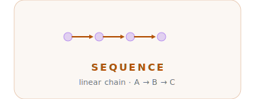
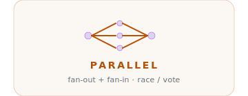
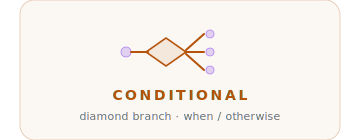
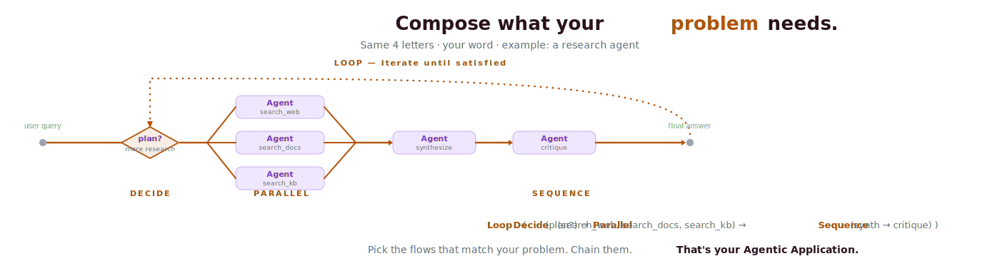
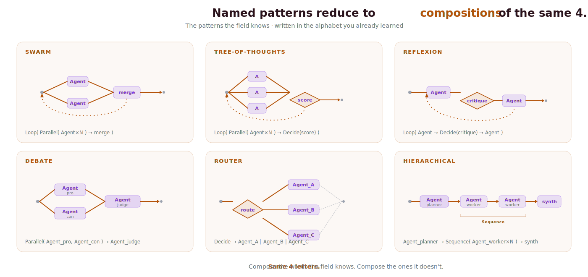

<p align="center">
  <picture>
    <source media="(prefers-color-scheme: dark)" srcset="docs/assets/hero-dark.svg">
    <source media="(prefers-color-scheme: light)" srcset="docs/assets/hero-light.svg">
    
  </picture>
</p>

<h1 align="center">Agentfootprint</h1>

<p align="center">
  <strong>We abstract context engineering — and hand back the trace.</strong><br/>
  <strong>Live</strong> to develop · <strong>offline</strong> to monitor · <strong>detailed</strong> to improve.
</p>

<p align="center">
  <a href="https://github.com/footprintjs/agentfootprint/actions"></a>
  <a href="https://codecov.io/gh/footprintjs/agentfootprint"></a>
  <a href="https://www.npmjs.com/package/agentfootprint"></a>
  <a href="https://www.npmjs.com/package/agentfootprint"></a>
  <a href="https://github.com/footprintjs/agentfootprint/blob/main/LICENSE"></a>
</p>

---

## 1. What we abstract

When you build an Agentic Application, you collect domain-specific data and instructions, then wire them up based on what your system receives.

That data and those instructions wear many names — **Skills · Steering · Guardrails · RAG · Tool APIs · Memory** — with more on the way. But they all do the same thing: they **inject into one of three slots** in the LLM call (`system`, `messages`, `tools`).

So we abstracted the injection itself.

<p align="center">
  <picture>
    <source media="(prefers-color-scheme: dark)" srcset="docs/assets/triggers-dark.svg">
    <source media="(prefers-color-scheme: light)" srcset="docs/assets/triggers-light.svg">
    
  </picture>
</p>

The abstraction is three rules:

1. **Three slots are fixed.** `system`, `messages`, `tools` — the LLM API surface.
2. **N flavors are open.** You declare what you have. Tomorrow's flavor (few-shot, reflection, persona, A2A handoff…) plugs in the same way.
3. **Rules decide *where* and *when*.** You provide the rules. We collect your data, fire the right one, land it in the right slot at the right iteration.

That's the whole model: `Injection = slot × trigger × cache`.

- **Slot** — which of the 3 LLM API regions the content lands in (`system` / `messages` / `tools`).
- **Trigger** — when the content fires (see below).
- **Cache** — how stable the content is across iterations. The framework places provider cache markers for you — stable content gets 80–90% cheaper prefixes.

### Triggers — static or runtime

Every rule fires from one of two places:

- **Static** — set at build time, fires every iteration *(always-on)*
- **Runtime** — fires from something that happens during the run:
  - a tool response  *(after_tool)*
  - an LLM activation  *(read_skill)*
  - a predicate over scope  *(rule)*

Four triggers, two flavors:

| # | Trigger | Fires when | One-line example | Default slot |
|---|---|---|---|---|
| 1 | `always` *(static)* | Every iteration | `.steering('You are a triage agent…')` | `system` |
| 2 | `rule` *(runtime — predicate)* | Your rule returns true | `.rag({ when: s => /price\|refund/.test(s.userQuery), source: docs })` | `messages` |
| 3 | `on-tool-return` *(runtime — lifecycle)* | After a specific tool returns | `.instruction({ after: 'search_db', text: 'Cite source IDs.' })` | `messages` |
| 4 | `llm-activated` *(runtime — agent-driven)* | LLM calls `read_skill('id')` | `.skill({ id: 'refund-policy', activatedBy: 'read_skill' })` | `messages` (body) |

> **Slot is a default, not a coupling — same flavor lives in any slot, strategy is config.**
> A `Skill` can live in:
> - `tools` slot → schema only, LLM discovers it via `read_skill` — trigger `always`
> - `messages` slot → body injected on activation — trigger `llm-activated`
> - `system` slot → body baked into the system prompt as permanent steering — trigger `always`

**3 slots × 4 triggers × N flavors = the entire context-engineering surface.** Locate any agent feature on this grid; that's enough to model it.

---

## 2. Why we chose this abstraction

Because owning the injection means we can answer four questions about every LLM call your agent makes:

- **What** was injected — which flavor, which content
- **Who** triggered it — which rule fired
- **When** it fired — which iteration, after which event
- **How** it landed — which slot, with what cache strategy

Those answers fold back into your workflow — the same triad in the tagline:

- **Live** — debug as you build, watch the trace scrub forward in real time
- **Offline** — monitor what shipped; query the trace months later without a rerun
- **Detailed** — improve via trace replay, root-cause analysis, and training-data export
- **Plus** — the LLM itself can use the trace to answer follow-up questions about its own decisions, no extra LLM call

### How — we own the runtime loop

Every load-bearing dev tool of the last decade made the same move — own the runtime loop, not just the API:

| Framework | You write | The framework abstracts |
|---|---|---|
| **PyTorch (autograd)** | Forward graph | Gradient computation, backward pass |
| **Express / Fastify** | Routes + handlers | HTTP loop, middleware chain |
| **Prisma** | Schema + query intent | SQL generation, migrations |
| **React** | Components + state | DOM diffing, render path |
| **agentfootprint** | Injections (slot × trigger × cache) | Slot composition, iteration loop, caching, observation, replay |

The closest structural parallel is **autograd**: you describe the graph, the framework traverses it, and *because the framework owns the traversal it can record everything for free*. Same idea here. In every other framework, flexibility and observability are a tradeoff — bolt-on instrumentation breaks when you customize. Here, both fall out of the same property: customization happens *inside* the recorded loop, not around it.

> 📖 Long-form: [the Palantir lineage](https://footprintjs.github.io/agentfootprint/inspiration/connected-data/) · [the Liskov lineage](https://footprintjs.github.io/agentfootprint/inspiration/modularity/)

---

## Where this sits

You'll find pieces of agentfootprint in two adjacent categories of framework.

- **Model-driven agent runners** let the LLM drive the loop. We ship one — Dynamic ReAct.
- **Low-level orchestration frameworks** let you wire nodes and edges. We ship the same compositions one level up: `Sequence` · `Parallel` · `Conditional` · `Loop`.

What neither category ships: the **Injection primitive** (Beat 1) and the **causal trace** (Beat 4). Both are free side effects of owning the runtime loop.

> agentfootprint = a model-driven agent runner + compositional orchestration + context engineering as a first-class layer, trace baked in.

---

## 3. How do I design my agent or system of agents?

Two scales — same alphabet. Four control flows are the entire vocabulary.

<table>
<tr>
<td width="50%" align="center">
  <picture>
    <source media="(prefers-color-scheme: dark)" srcset="docs/assets/sequence-dark.svg">
    <source media="(prefers-color-scheme: light)" srcset="docs/assets/sequence-light.svg">
    
  </picture>
</td>
<td width="50%">

```typescript
import { Sequence } from 'agentfootprint';

const flow = Sequence.create()
  .step('a', stageA)
  .step('b', stageB)
  .step('c', stageC)
  .build();
```

</td>
</tr>
<tr>
<td width="50%" align="center">
  <picture>
    <source media="(prefers-color-scheme: dark)" srcset="docs/assets/parallel-dark.svg">
    <source media="(prefers-color-scheme: light)" srcset="docs/assets/parallel-light.svg">
    
  </picture>
</td>
<td width="50%">

```typescript
import { Parallel } from 'agentfootprint';

const fan = Parallel.create()
  .branch('web', searchWeb)
  .branch('docs', searchDocs)
  .mergeWithFn(synthesizer)
  .build();
```

</td>
</tr>
<tr>
<td width="50%" align="center">
  <picture>
    <source media="(prefers-color-scheme: dark)" srcset="docs/assets/conditional-dark.svg">
    <source media="(prefers-color-scheme: light)" srcset="docs/assets/conditional-light.svg">
    
  </picture>
</td>
<td width="50%">

```typescript
import { Conditional } from 'agentfootprint';

const router = Conditional.create()
  .when('billing', s => s.intent === 'billing', billingAgent)
  .when('tech',    s => s.intent === 'tech',    techAgent)
  .otherwise('default', defaultAgent)
  .build();
```

</td>
</tr>
<tr>
<td width="50%" align="center">
  <picture>
    <source media="(prefers-color-scheme: dark)" srcset="docs/assets/loop-dark.svg">
    <source media="(prefers-color-scheme: light)" srcset="docs/assets/loop-light.svg">
    
  </picture>
</td>
<td width="50%">

```typescript
import { Loop } from 'agentfootprint';

const reflexion = Loop.create()
  .repeat(thinkAgent)
  .until(s => s.satisfied)
  .build();
```

</td>
</tr>
</table>

### Inside one agent — Dynamic vs Classic ReAct

<p align="center">
  <picture>
    <source media="(prefers-color-scheme: dark)" srcset="docs/assets/dynamic-vs-classic-dark.svg">
    <source media="(prefers-color-scheme: light)" srcset="docs/assets/dynamic-vs-classic-light.svg">
    
  </picture>
</p>

**Same five stages on both sides. Only one thing differs — where the loop returns.** Classic ReAct loops back to `CallLLM` and slots stay frozen. Dynamic ReAct (agentfootprint) loops back to `SystemPrompt`, so injections that fired on the previous tool result recompose the next prompt. Per-iteration recomposition is also the structural prerequisite for the cache layer.

```text
Classic ReAct                    Dynamic ReAct
───────────────                  ─────────────
iter 1: 12 tools shown           iter 1: 1 tool  (read_skill)
iter 2: 12 tools shown           iter 2: 5 tools (skill activated)
iter 3: 12 tools shown           iter 3: 5 tools
```

> 📖 [Dynamic ReAct guide](https://footprintjs.github.io/agentfootprint/guides/dynamic-react/) · [Cache layer](https://footprintjs.github.io/agentfootprint/guides/caching/)

### Multi-agent — compose with the alphabet

<p align="center">
  <picture>
    <source media="(prefers-color-scheme: dark)" srcset="docs/assets/compose-dark.svg">
    <source media="(prefers-color-scheme: light)" srcset="docs/assets/compose-light.svg">
    
  </picture>
</p>

Pick the flows that match your problem. Chain them. **That's your Agentic Application.**

```typescript
const research = Loop.create()
  .repeat(Sequence.create().step('plan', plan).step('search', searchAll).build())
  .until(s => s.satisfied).build();
```

Same `.create().method().build()` shape as the four rows above — just composed.

### Named patterns — also compositions of the same 4

<p align="center">
  <picture>
    <source media="(prefers-color-scheme: dark)" srcset="docs/assets/patterns-dark.svg">
    <source media="(prefers-color-scheme: light)" srcset="docs/assets/patterns-light.svg">
    
  </picture>
</p>

The patterns the field knows reduce to the same alphabet:

| Pattern | Composition |
|---|---|
| **Swarm** | `Loop( Parallel( Agent×N ) → merge )` |
| **Tree-of-Thoughts** | `Loop( Parallel( Agent×N ) → Conditional(score) )` |
| **Reflexion** | `Loop( Agent → Conditional(critique) → Agent )` |
| **Debate** | `Parallel( Agent_pro, Agent_con ) → Agent_judge` |
| **Router** | `Conditional → Agent_A \| Agent_B \| Agent_C` |
| **Hierarchical** | `Agent_planner → Sequence( Agent_worker×N ) → synth` |

Same trick as Beat 1: instead of N libraries for N patterns, we found the M building blocks all N patterns are made of.

> 📖 Compare: [hand-rolled vs declarative](https://footprintjs.github.io/agentfootprint/getting-started/why/) · [migration from LangChain / CrewAI / LangGraph](https://footprintjs.github.io/agentfootprint/getting-started/vs/)

---

## 4. How do I see what my agent did?

Because we own the loop (Beat 2), every decision and execution is captured during traversal — not bolted on. The default capture is the **causal trace**: every stage, read, write, and decision evidence, as a JSON-portable, scrubbable, queryable, exportable artifact. Beyond the default, wire custom recorders for cost, latency, or quality scoring — any observation hook fires on the same stream.

<p align="center">
  <picture>
    <source media="(prefers-color-scheme: dark)" srcset="docs/assets/causal-memory-dark.svg">
    <source media="(prefers-color-scheme: light)" srcset="docs/assets/causal-memory-light.svg">
    
  </picture>
</p>

The same trace serves three downstream consumers — no extra instrumentation:

1. **Audit / compliance.** Six months later, *"why was loan #42 rejected?"* answers from the chain (`creditScore=580 < 620 ∧ dti=0.6 > 0.43 → riskTier=high → REJECTED`). No LLM call. GDPR Art. 22, ECOA, and EU AI Act adverse-action notices write themselves from the captured decision evidence.

2. **Cheap-model triage.** A Sonnet trace becomes good *input* for Haiku to answer follow-ups. ~200 tokens at any model ($0.25/1M) vs ~2,500 tokens at a reasoning model ($15/1M). Memoization for agent thinking — no agent rerun.

3. **Training data export.** Every successful chain is a labeled trajectory — `causalMemory.exportForTraining({ format: 'sft' \| 'dpo' \| 'process-rl' })`. The chain provides per-step rewards out of the box, so process-RL is ready without a separate data-collection phase.

Two built-in lenses view the same trace:

| Lens | View | When to use |
|---|---|---|
| **Lens** | Agent-centric — User/Agent[3 slots]/Tool flowchart with iteration scrubber and round commentary | Live debugging, "what did Neo see at step 5?" |
| **Explainable Trace** | Structural — subflow tree, full flowchart, memory inspector, per-stage execution timeline | Architecture review, root-cause analysis |

> 📖 Powered by [footprintjs `causalChain()`](https://footprintjs.github.io/footPrint/blog/backward-causal-chain/) — backward thin-slicing on the commit log. [Causal memory guide](https://footprintjs.github.io/agentfootprint/guides/causal-memory/) · [Explainability & compliance](https://footprintjs.github.io/footPrint/blog/explainability-compliance/)

**One recording. Two lenses. Three consumers. Zero extra instrumentation.**

---

## Quick start — runs offline, no API key

```bash
npm install agentfootprint footprintjs
```

```typescript
import { Agent, defineTool, mock } from 'agentfootprint';

const weather = defineTool({
  name: 'weather',
  description: 'Get current weather for a city.',
  inputSchema: {
    type: 'object',
    properties: { city: { type: 'string' } },
    required: ['city'],
  },
  execute: async ({ city }: { city: string }) => `${city}: 72°F, sunny`,
});

const agent = Agent.create({
  provider: mock({ reply: 'I checked: it is 72°F and sunny.' }),
  model: 'mock',
})
  .system('You answer weather questions using the weather tool.')
  .tool(weather)
  .build();

const result = await agent.run({ message: 'Weather in Paris?' });
console.log(result);  // → "I checked: it is 72°F and sunny."
```

Swap `mock(...)` for `anthropic(...)` / `openai(...)` / `bedrock(...)` / `ollama(...)` for production. Nothing else changes.

---

## Mocks first, production second

Build the entire app against in-memory mocks with **zero API cost**, then swap real infrastructure one boundary at a time.

| Boundary | Dev | Prod |
|---|---|---|
| LLM provider | `mock(...)` | `anthropic()` · `openai()` · `bedrock()` · `ollama()` |
| Memory store | `InMemoryStore` | `RedisStore` · `AgentCoreStore` · DynamoDB / Postgres / Pinecone |
| MCP | `mockMcpClient(...)` | `mcpClient({ transport })` |
| Cache strategy | `NoOpCacheStrategy` | auto-selected per provider |

The flowchart, recorders, and tests don't change between dev and prod.

---

## What ships today

**Core**
- 2 primitives — `LLMCall`, `Agent` (the ReAct loop)
- 4 control flows — `Sequence`, `Parallel`, `Conditional`, `Loop`
- One Injection primitive — `defineSkill` / `defineSteering` / `defineInstruction` / `defineFact`

**Adapters**
- 7 LLM providers — Anthropic · OpenAI · Bedrock · Ollama · Browser-Anthropic · Browser-OpenAI · Mock
- RAG · MCP · Memory store adapters — InMemory · Redis · AgentCore (Postgres / DynamoDB / Pinecone via lazy peer-deps)

**Operability**
- One Memory factory — 4 types × 7 strategies including **Causal**
- Provider-agnostic prompt caching — declarative per-injection, per-iteration marker recomputation
- Pause / resume — JSON-serializable checkpoints; resume hours later on a different server
- Resilience — `withRetry`, `withFallback`, `resilientProvider`
- 48+ typed observability events — context · stream · agent · cost · skill · permission · eval · memory · cache · embedding · error

**Tooling**
- **Lens** · **Explainable Trace** — two visual replays of the causal trace
- AI-coding-tool support — Claude Code · Cursor · Windsurf · Cline · Kiro · Copilot

> 📖 [Full feature list & API reference](https://footprintjs.github.io/agentfootprint/reference/) · [CHANGELOG](./CHANGELOG.md)

---

## Roadmap

| Theme | Focus |
|---|---|
| Reliability | Circuit breaker, output fallback, auto-resume-on-error |
| Causal exports | `causalMemory.exportForTraining({ format: 'sft' \| 'dpo' \| 'process' })` |
| Governance | Policies, budget tracking, production memory adapters |
| Cache v2 | Gemini handle-based caching, cost attribution |
| Deep agents | Planning-before-execution, A2A protocol, Lens UI |

Roadmap items are *not* current API claims. If a feature isn't in `npm install agentfootprint` today, it's listed here, not in the docs.

---

## Where to next

| If you are... | Go here |
|---|---|
| New to agents | [5-minute quick start](https://footprintjs.github.io/agentfootprint/getting-started/quick-start/) |
| Coming from LangChain / CrewAI / LangGraph | [Migration guide](https://footprintjs.github.io/agentfootprint/getting-started/vs/) |
| Architecting an enterprise rollout | [Production guide](https://footprintjs.github.io/agentfootprint/guides/deployment/) |
| Doing due diligence | [Architecture overview](https://footprintjs.github.io/agentfootprint/architecture/) |
| Researcher / extending | [Extension guide](https://footprintjs.github.io/agentfootprint/contributing/extension-guide/) |
| Curious about design | [Inspiration docs](https://footprintjs.github.io/agentfootprint/inspiration/) |

Or jump into the [examples gallery](https://github.com/footprintjs/agentfootprint/tree/main/examples) — every example is also an end-to-end CI test.

---

## Built on

[footprintjs](https://github.com/footprintjs/footPrint) — the flowchart pattern for backend code. agentfootprint's decision-evidence capture, narrative recording, and time-travel checkpointing are footprintjs primitives at the runtime layer.

You don't need to learn footprintjs to use agentfootprint — but if you want to build your own primitives at this depth, [start there](https://footprintjs.github.io/footPrint/).

---

## License

[MIT](./LICENSE) © [Sanjay Krishna Anbalagan](https://github.com/sanjay1909)
