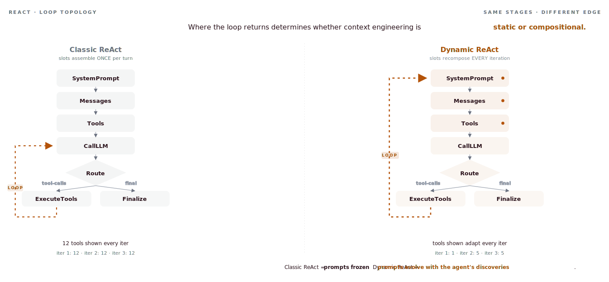

<p align="center">
  <picture>
    <source media="(prefers-color-scheme: dark)" srcset="docs/assets/hero-dark.svg">
    <source media="(prefers-color-scheme: light)" srcset="docs/assets/hero-light.svg">
    
  </picture>
</p>

<h1 align="center">agentfootprint</h1>

<p align="center">
  <a href="https://github.com/footprintjs/agentfootprint/actions"></a>
  <a href="https://codecov.io/gh/footprintjs/agentfootprint"></a>
  <a href="https://www.npmjs.com/package/agentfootprint"></a>
  <a href="https://www.npmjs.com/package/agentfootprint"></a>
  <a href="https://github.com/footprintjs/agentfootprint/blob/main/LICENSE"></a>
</p>

---

## What is agentfootprint?

**A framework for building AI agents by treating context as a first-class runtime system.**

Most agent code becomes context plumbing: which instructions go in `system`, which messages get added after a tool returns, which tools should be exposed right now, which memory to load for this tenant, which parts of the prompt are stable enough to cache.

Without a framework, every agent hand-rolls this logic. Over time it becomes a fragile mix of prompt concatenation, tool routing, memory loading, cache markers, observability hooks, and retry logic.

**agentfootprint abstracts that bookkeeping.** You declare what context to inject, where it lands, and when it activates. The framework owns the agent loop, recomposes the LLM call every iteration, records typed events, applies caching, and persists replayable checkpoints.

> You write the intent. agentfootprint owns the context loop.

---

## The lineage

Every load-bearing dev tool of the last decade made the same move:

| Framework | You write | The framework abstracts |
|---|---|---|
| **PyTorch (autograd)** | Forward graph | Gradient computation, backward pass |
| **Express / Fastify** | Routes + handlers | HTTP loop, middleware chain |
| **Prisma** | Schema + query intent | SQL generation, migrations |
| **React** | Components + state | DOM diffing, render path |
| **agentfootprint** | Injections (slot × trigger × cache) | Slot composition, iteration loop, caching, observation, replay |

The closest structural parallel is **autograd**: you describe the graph, the framework traverses it, and *because the framework owns the traversal it can record everything for free*. Same idea here — typed events, replayable checkpoints, and provider-agnostic prompt caching are consequences of owning the loop, not extra features.

---

## The core idea

Every LLM call has three slots:

```text
system     messages     tools
```

Every agent feature — steering, instructions, skills, facts, memory, RAG, tool schemas — is content flowing into one of those slots. agentfootprint models all of them as one primitive:

```text
Injection = slot × trigger × cache
```

An Injection answers three questions:

1. **Where does this content land?** `system`, `messages`, or `tools`
2. **When does it activate?** `always` · `rule` · `on-tool-return` · `llm-activated`
3. **How is it cached?** `always` · `never` · `while-active` · predicate

That is the whole abstraction. Every named pattern in the agent literature — Reflexion, Tree-of-Thoughts, Skills, RAG, Constitutional AI — reduces to *which slot* + *which trigger*. You learn one model; the field's growth lands as new factories on the same primitive.

```text
                         LLM call
        ┌────────────────────────────────────┐
        │   system      messages      tools  │
        │      ▲            ▲            ▲   │
        └──────┼────────────┼────────────┼───┘
               │            │            │
          Injection     Injection     Injection
               ▲
               │
      always · rule · on-tool-return · llm-activated
```

---

## Why this isn't just an ergonomics win — Dynamic ReAct

<p align="center">
  <picture>
    <source media="(prefers-color-scheme: dark)" srcset="docs/assets/dynamic-vs-classic-dark.svg">
    <source media="(prefers-color-scheme: light)" srcset="docs/assets/dynamic-vs-classic-light.svg">
    
  </picture>
</p>

**Same five stages on both sides. Only one thing differs — where the loop returns.**

- **Classic ReAct** loops back to `CallLLM`. The `SystemPrompt`/`Messages`/`Tools` boxes ran once at the top of the turn and stay frozen for the rest of the iteration. The agent sees the same 12 tools on every iteration regardless of what it just discovered.
- **Dynamic ReAct** (agentfootprint) loops back to `SystemPrompt`. Every iteration re-enters the slot subflows, so injections that fired on the previous tool result get a chance to recompose the next prompt. The agent sees a 1-tool list on iter 1, then a 5-tool list once a skill activated, then keeps the focused list for the rest of the turn.

That structural choice — *where the loop edge points* — is the difference between context engineering that's **static or compositional**.

How does this compare to other frameworks?

- **LangChain** assembles prompts once per turn.
- **LangGraph** composes state per node, not per loop iteration.
- **agentfootprint** recomposes per iteration.

Per-iteration recomposition is also the structural prerequisite for the cache layer — cache markers can't track active injections in lockstep without it.

```text
Classic ReAct                    Dynamic ReAct
───────────────                  ─────────────
iter 1: 12 tools shown           iter 1: 1 tool  (read_skill)
iter 2: 12 tools shown           iter 2: 5 tools (skill activated)
iter 3: 12 tools shown           iter 3: 5 tools
```

Use **Dynamic ReAct** when your tools have dependencies (one tool's output implies which tool to call next). Use **Classic ReAct** when all tools are independent and ordering doesn't matter.

> 📖 Deep dive: [Dynamic ReAct guide](https://footprintjs.github.io/agentfootprint/guides/dynamic-react/) · [Cache layer](https://footprintjs.github.io/agentfootprint/guides/caching/)

---

## Quick start — runs offline, no API key

```bash
npm install agentfootprint footprintjs
```

```typescript
import { Agent, defineTool, mock } from 'agentfootprint';

const weather = defineTool({
  name: 'weather',
  description: 'Get current weather for a city.',
  inputSchema: {
    type: 'object',
    properties: { city: { type: 'string' } },
    required: ['city'],
  },
  execute: async ({ city }: { city: string }) => `${city}: 72°F, sunny`,
});

const agent = Agent.create({
  provider: mock({ reply: 'I checked: it is 72°F and sunny.' }),
  model: 'mock',
})
  .system('You answer weather questions using the weather tool.')
  .tool(weather)
  .build();

const result = await agent.run({ message: 'Weather in Paris?' });
console.log(result);  // → "I checked: it is 72°F and sunny."
```

Swap `mock(...)` for `anthropic(...)` / `openai(...)` / `bedrock(...)` / `ollama(...)` for production. Nothing else changes.

---

## A real agent in 8 lines

```typescript
const agent = Agent.create({ provider, model: 'claude-sonnet-4-5-20250929' })
  .system('You are a support assistant.')
  .steering(toneRule)            // always-on
  .instruction(urgentRule)       // rule-gated
  .skill(billingSkill)           // LLM-activated
  .memory(conversationMemory)    // cross-run, multi-tenant
  .tool(weather)
  .build();

await agent.run({ message: userInput, identity: { conversationId } });
```

The hand-rolled equivalent is ~80 lines of slot management, trigger evaluation, memory loading, and cache marker placement — and growing with every feature. The declarative version stays at 8.

> 📖 Compare: [hand-rolled vs declarative](https://footprintjs.github.io/agentfootprint/getting-started/why/) · [migration from LangChain / CrewAI / LangGraph](https://footprintjs.github.io/agentfootprint/getting-started/vs/)

---

## The differentiator: the trace is a cache of the agent's thinking

Other agent frameworks remember *what was said*. agentfootprint's causal memory records the **decision evidence** — every value the flowchart captured during the run, persisted as a JSON-portable snapshot.

That changes the cost structure of everything that happens after the agent runs:

1. **Audit / explain** — six months later, "why was loan #42 rejected?" answers from the original evidence (creditScore=580, threshold=600), not reconstruction.
2. **Cheap-model triage** — a trace from Sonnet is good *input* for Haiku to answer follow-up questions about that run. Memoization for agent reasoning.
3. **Training data** — every successful production run is a labeled trajectory for SFT/DPO/process-RL, no separate data-collection phase.

One recording, three downstream consumers, no extra instrumentation.

> 📖 Deep dive: [Causal memory guide](https://footprintjs.github.io/agentfootprint/guides/causal-memory/)

---

## What you can build

```typescript
// Customer support — skills + memory + audit + cache
const agent = Agent.create({ provider, model })
  .system('You are a friendly support assistant.')
  .skill(billingSkill)
  .steering(toneGuidelines)
  .memory(conversationMemory)
  .build();

// Research pipeline — multi-agent fan-out + merge
const research = Parallel.create()
  .branch(optimist).branch(skeptic).branch(historian)
  .merge(synthesizer)
  .build();

// Streaming chat — token-by-token to a browser via SSE
agent.on('agentfootprint.stream.token', (e) => res.write(toSSE(e)));
await agent.run({ message: req.query.message });
```

> 📖 Full examples: [examples gallery](https://github.com/footprintjs/agentfootprint/tree/main/examples) · every example is also a CI test.

---

## Mocks first, production second

Build the entire app against in-memory mocks with **zero API cost**, then swap real infrastructure one boundary at a time.

| Boundary | Dev | Prod |
|---|---|---|
| LLM provider | `mock(...)` | `anthropic()` · `openai()` · `bedrock()` · `ollama()` |
| Memory store | `InMemoryStore` | `RedisStore` · `AgentCoreStore` · DynamoDB / Postgres / Pinecone |
| MCP | `mockMcpClient(...)` | `mcpClient({ transport })` |
| Cache strategy | `NoOpCacheStrategy` | auto-selected per provider |

The flowchart, recorders, and tests don't change between dev and prod.

---

## What ships today

- **2 primitives** — `LLMCall`, `Agent` (the ReAct loop)
- **4 compositions** — `Sequence`, `Parallel`, `Conditional`, `Loop`
- **7 LLM providers** — Anthropic · OpenAI · Bedrock · Ollama · Browser-Anthropic · Browser-OpenAI · Mock
- **One Injection primitive** — `defineSkill` / `defineSteering` / `defineInstruction` / `defineFact`
- **One Memory factory** — 4 types × 7 strategies including **Causal**
- **Provider-agnostic prompt caching** — declarative per-injection, per-iteration marker recomputation
- **RAG · MCP · Memory store adapters** — InMemory · Redis · AgentCore
- **48+ typed observability events** across context · stream · agent · cost · skill · permission · eval · memory · cache · embedding · error
- **Pause / resume** — JSON-serializable checkpoints; resume hours later on a different server
- **Resilience** — `withRetry`, `withFallback`, `resilientProvider`
- **AI-coding-tool support** — Claude Code · Cursor · Windsurf · Cline · Kiro · Copilot

> 📖 [Full feature list & API reference](https://footprintjs.github.io/agentfootprint/reference/) · [CHANGELOG](./CHANGELOG.md)

---

## Roadmap

| Theme | Focus |
|---|---|
| Reliability | Circuit breaker, output fallback, auto-resume-on-error |
| Causal exports | `causalMemory.exportForTraining({ format: 'sft' \| 'dpo' \| 'process' })` |
| Governance | Policies, budget tracking, production memory adapters |
| Cache v2 | Gemini handle-based caching, cost attribution |
| Deep agents | Planning-before-execution, A2A protocol, Lens UI |

Roadmap items are *not* current API claims. If a feature isn't in `npm install agentfootprint` today, it's listed here, not in the docs.

---

## Design philosophy

Two principles shape the runtime:

**Connected data (Palantir, 2003).** Enterprise insight is bottlenecked by data fragmentation, not analyst skill. Agents face the same problem at runtime — disconnected tool state, lost decision evidence, scattered execution context. agentfootprint connects state, decisions, execution, and memory into one runtime footprint so the next iteration compounds the connection instead of paying for it again.

**Modular boundaries (Liskov, 1974).** Every framework boundary — `LLMProvider`, `ToolProvider`, `CacheStrategy`, `Recorder`, `MemoryStore` — is an LSP-substitutable interface. Swap implementations without changing agent code.

Connected data alone is fast but unmaintainable. Modular boundaries alone are clean but dumb. Together: a runtime that's both fast and reasonable.

> 📖 Long-form: [the Palantir lineage](https://footprintjs.github.io/agentfootprint/inspiration/connected-data/) · [the Liskov lineage](https://footprintjs.github.io/agentfootprint/inspiration/modularity/)

---

## Where to next

| If you are... | Go here |
|---|---|
| New to agents | [5-minute quick start](https://footprintjs.github.io/agentfootprint/getting-started/quick-start/) |
| Coming from LangChain / CrewAI / LangGraph | [Migration guide](https://footprintjs.github.io/agentfootprint/getting-started/vs/) |
| Architecting an enterprise rollout | [Production guide](https://footprintjs.github.io/agentfootprint/guides/deployment/) |
| Doing due diligence | [Architecture overview](https://footprintjs.github.io/agentfootprint/architecture/) |
| Researcher / extending | [Extension guide](https://footprintjs.github.io/agentfootprint/contributing/extension-guide/) |
| Curious about design | [Inspiration docs](https://footprintjs.github.io/agentfootprint/inspiration/) |

Or jump into the [examples gallery](https://github.com/footprintjs/agentfootprint/tree/main/examples) — every example is also an end-to-end CI test.

---

## Built on

[footprintjs](https://github.com/footprintjs/footPrint) — the flowchart pattern for backend code. The decision-evidence capture, narrative recording, and time-travel checkpointing this library uses are footprintjs primitives. The same way autograd's forward-pass traversal is what makes gradient inspection automatic, footprintjs's flowchart traversal is what makes agentfootprint's typed-event stream and replayable traces automatic.

You don't need to learn footprintjs to use agentfootprint — but if you want to build your own primitives at this depth, [start there](https://footprintjs.github.io/footPrint/).

---

## License

[MIT](./LICENSE) © [Sanjay Krishna Anbalagan](https://github.com/sanjay1909)
