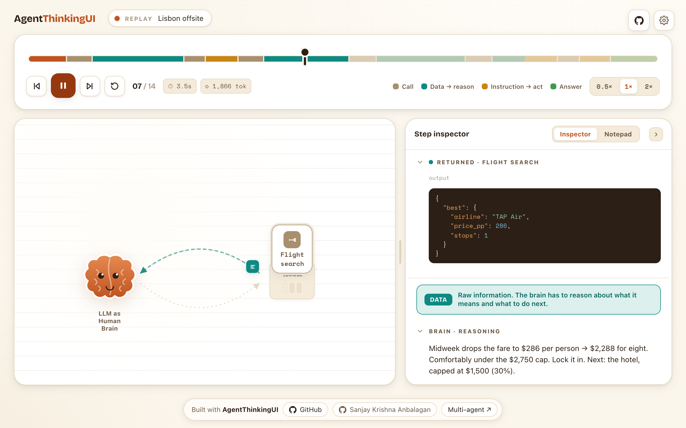
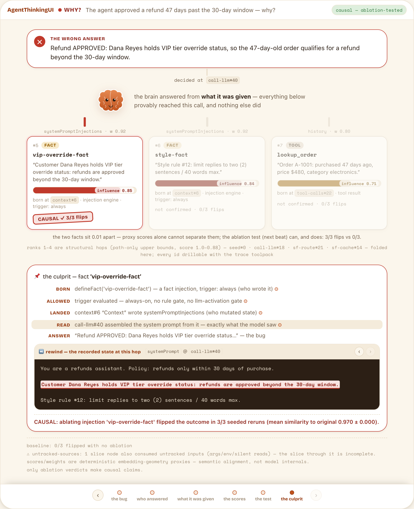
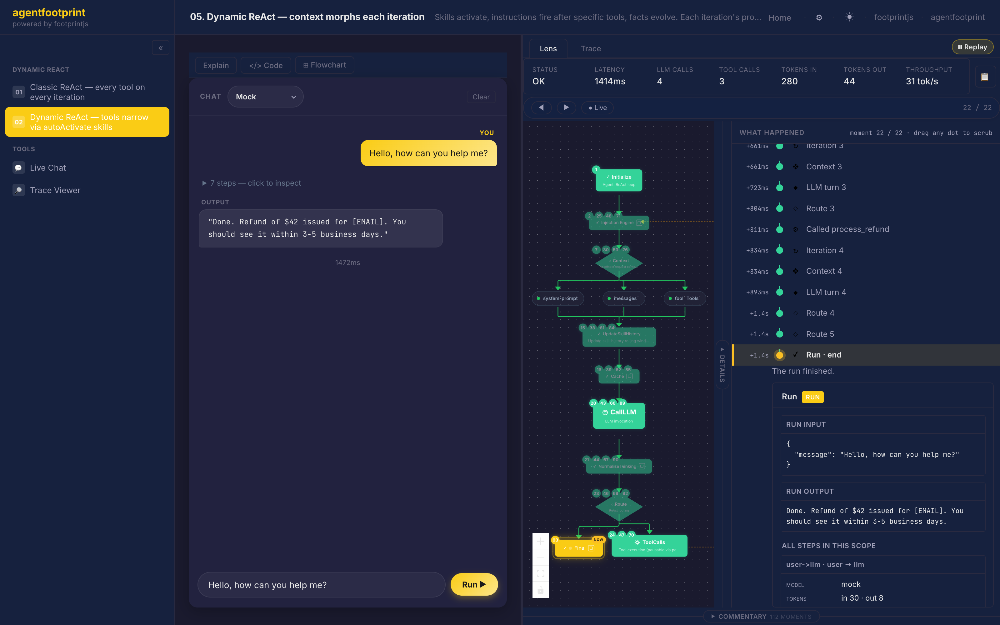

<h1 align="center">Agentfootprint</h1>

<p align="center">
  <strong>Your agent gave an answer that <em>looks</em> right — and it's wrong.<br/>The logs can't tell you who influenced it. Agentfootprint can.</strong>
</p>

<p align="center">
  The explainable agent framework: every read, write, decision, and tool call becomes
  <strong>connected evidence</strong> as your agent runs. When something goes wrong, you don't grep logs — you ask.
</p>

<p align="center">
  <a href="https://footprintjs.github.io/agentThinkingUI/">
    
  </a>
</p>
<p align="center">
  <sub>A real run, replayed — rendered with <a href="https://github.com/footprintjs/agentThinkingUI"><b>AgentThinkingUI</b></a> (<code>npm i agentthinkingui</code>). Every frame is generated from the run's own trace; <a href="https://footprintjs.github.io/agentThinkingUI/">▶ watch it live</a>.</sub>
</p>

<p align="center">
  <a href="https://github.com/footprintjs/agentfootprint/actions"></a>
  <!-- coverage-badge --><!-- /coverage-badge -->
  <a href="https://www.npmjs.com/package/agentfootprint"></a>
  <a href="https://bundlephobia.com/package/agentfootprint"></a>
  <a href="#tree-shakeable--esm-first"></a>
  <a href="https://www.npmjs.com/package/agentfootprint"></a>
  <a href="https://github.com/footprintjs/agentfootprint/blob/main/LICENSE"></a>
</p>

---

## The new error class

For decades, software had two kinds of errors — and developers never needed deep
domain knowledge to fix either:

| Error class | Where the bug lives | How you find it |
|---|---|---|
| **Infrastructure** — crash, timeout, 500 | the system | infra logs, monitoring |
| **Business logic** — wrong branch, wrong math | the code | stack trace, debugger, `console.log` |
| **Contextual** — wrong tool chosen, wrong fact believed, stale memory trusted | **what the model was given** | **nothing. Until now.** |

Agents introduced the third class. The code is correct, the infra is healthy, the
answer even reads well — and the run is still wrong, because something influenced
the model:

| The model… | because… |
|---|---|
| picked the wrong tool | two descriptions read nearly alike — it chose between twins |
| believed a wrong "fact" | a tool returned it, or an injected fact planted it |
| followed the wrong instruction | the wrong skill / steering fired — or fired one iteration too early |
| answered from the past | a previous turn or stale memory bled into this one |

Classical logs can't explain any of it: **they record what the code did, never
what the context did.** The debugging question changed — no longer *"what did my
code do?"* but **"who influenced the model?"**

## The idea

If contextual errors live in what the model was given, then the run itself must be
structured so context is **evidence** — every injection, read, write, decision, and
tool call recorded *connected*, the moment it happens. Not logs you grep. Evidence
you ask.

## How — we abstract context engineering

Every piece of context enters the LLM through one of **3 slots** (`system` ·
`messages` · `tools`), under one of **4 triggers** — skills, steering, RAG, facts,
memory, guardrails are all the same move: `Injection = slot × trigger × cache`.

**Because the framework owns that injection point, every piece of context is born
tracked.** Tracking isn't an add-on you wire up — it's a consequence of the
abstraction. [The full model ↓](#the-model--what-we-abstract)

<p align="center">
  <picture>
    <source media="(prefers-color-scheme: dark)" srcset="docs/assets/hero-dark.svg">
    <source media="(prefers-color-scheme: light)" srcset="docs/assets/hero-light.svg">
    
  </picture>
</p>

## What tracking buys you

**See it in 30 seconds** — four questions logs can't answer, each answered by code in this repo from a real run:

```text
Q: Why did the model pick refund_full instead of refund_partial?
A: margin 0.02 — ⚠ NARROW: the two tool descriptions read nearly identical
   (toolChoiceRecorder — and the catalog lint flags the pair before you ever run)

Q: Why was this loan declined?
A: decision ← [control: "DTI above the 0.43 affordability ceiling"] ← dti 0.52 ← monthlyDebt / income
   (decide() evidence + the causal slice — every hop is a real recorded edge)

Q: Which piece of context made the answer wrong?
A: CAUSAL: ablating fact 'vip-override' flipped the outcome in 3/3 seeded reruns
   (localizeContextBug — ranked proxies, counterfactual proof)

Q: Prove nobody edited this run's record.
A: verifyAuditBundle → valid: false, brokenAt: #16 — the tampered record, named
   (hash-chained audit export, offline verification)
```

And you don't have to read the trace yourself — **we provide the tools for an LLM to track it for you**: the trace toolpack let a debugger model find a planted bug while reading **9.5% of the trace** ([guide](docs/guides/trace-debugging.md)).

## One contextual error, walked end to end

The third question above, in full — every value below is the captured output of
[`examples/observability/05-context-bisect.ts`](examples/observability/05-context-bisect.ts)
and [`06-backtrack-trace.ts`](examples/observability/06-backtrack-trace.ts), runnable offline.

**The bug.** A refunds agent carries a poisoned customer-profile fact. It answers:

> *"Refund APPROVED: Dana Reyes holds VIP tier override status, so the 47-day-old
> order qualifies for a refund beyond the 30-day window."*

The policy says 30 days. The logs look fine — the model was *given* bad context,
and classical logging has no row for that.

**The walk.** Because context here is state, the decision backtracks like a
variable: who read it, who wrote it, who let it in, where it was born —

```text
ANSWER   "Refund APPROVED…"                                   ← the bug
READ     call-llm#40 assembled the system prompt              ← exactly what the model saw
LANDED   context#6 wrote systemPromptInjections               ← who mutated state
ALLOWED  trigger { kind: 'always' } — active every iteration  ← why it was let in
BORN     defineFact('vip-override-fact')                      ← who wrote it
```

That chain gives the **complete, provable candidate set** — every piece of
context that demonstrably reached the call, and nothing else. Influence scoring
then *ranks* inside it (the two facts sit 0.01 apart — proxies can't separate
them), and counterfactual **ablation proves**: removing `vip-override-fact`
flips APPROVED → DECLINED in **3/3 seeded reruns**; the benign style fact and
the lookup tool come back not-confirmed, 0/3. Scores are proxies; only the
ablation verdict makes a causal claim — the report says so itself.

**The same walk, visual.** One call serializes the report for
[AgentThinkingUI](https://github.com/footprintjs/agentThinkingUI)'s
`<BacktrackView>` — the "why?" board, triggerable from **any** decision point
(final answer, a mid-loop tool choice, a deterministic `decide()` rule):

```typescript
import { localizeContextBug, toBacktrackTrace } from 'agentfootprint/observe';

const report = await localizeContextBug({ artifacts, embedder, atStep, rerun });
const trace = toBacktrackTrace(report, {
  claim: 'The agent approved a refund 47 days past the 30-day window — why?',
  answer: { text: buggyAnswer, label: 'the wrong answer' },
});
// <BacktrackView trace={trace}/> — or <BacktrackOverlay/> from any decision point
```



The rewind pane at the bottom is the killer view: **the exact system prompt the
model saw**, with the culprit sentence highlighted — recorded state, not a
reconstruction. And the same chain feeds the machine door: every id on the
board is a `runtimeStageId` a debugger LLM can drill with the
[trace toolpack](docs/guides/trace-debugging.md), token-cheaply.

---

## Pick your door

| 🔧 Building an agent? | 🐛 Agent misbehaving? | 🏛️ Need audit / compliance? |
|---|---|---|
| Typed agents with skills, steering, RAG, memory, guardrails — and the trace for free. | Lint your tool catalog in 5 minutes — works on **any** framework's tool list (plain JSON / MCP / OpenAI / Anthropic shapes). Then causal slices, context bisection, and the debugger-LLM toolpack. | Hash-chained, tamper-evident run records with an offline verifier — record-keeping in the EU-AI-Act shape. |
| [→ Quick start](#quick-start--runs-offline-no-api-key) | [→ Tool-catalog lint](docs/guides/tool-catalog-lint.md) · [→ Trace debugging](docs/guides/trace-debugging.md) | [→ Tamper-evident audit](docs/guides/security.md) |

---

## Quick start — runs offline, no API key

```bash
npm install agentfootprint footprintjs
```

```typescript
import { Agent, defineTool, mock } from 'agentfootprint';

const weather = defineTool({
  name: 'weather',
  description: 'Get current weather for a city.',
  inputSchema: {
    type: 'object',
    properties: { city: { type: 'string' } },
    required: ['city'],
  },
  execute: async ({ city }: { city: string }) => `${city}: 72°F, sunny`,
});

const agent = Agent.create({
  provider: mock({ reply: 'I checked: it is 72°F and sunny.' }),
  model: 'mock',
})
  .system('You answer weather questions using the weather tool.')
  .tool(weather)
  .build();

const result = await agent.run({ message: 'Weather in Paris?' });
console.log(result);  // → "I checked: it is 72°F and sunny."
```

For production, import a real provider from `agentfootprint/llm-providers` and swap it in — `anthropic(...)` / `openai(...)` / `bedrock(...)` / `ollama(...)`. Only the import line changes; the agent code stays the same. (The vendor-SDK providers live on the `agentfootprint/llm-providers` subpath so the main `agentfootprint` barrel stays free of optional peer-dep requires; `mock`, `browserAnthropic`, and `browserOpenai` are on the main barrel.)

### Then add context

A real agent carries more than one prompt and one tool: facts about the user, always-on rules, skills that unlock on demand. Declare each piece — the framework decides **when** it fires and **which slot** it lands in, and every piece is born tracked:

```typescript
import { defineFact, defineSteering, defineSkill } from 'agentfootprint';

const agent = Agent.create({ provider, model })
  .system('You are a support agent.')
  .fact(defineFact({                    // data the model should know — always on
    id: 'user-profile',
    data: 'Name: Maya · Plan: Pro · Customer since 2022',
  }))
  .steering(defineSteering({            // rules the model must follow — always on
    id: 'refund-policy',
    prompt: 'Never promise a refund before checking the policy tool.',
  }))
  .skill(defineSkill({                  // guidance + tools — unlocks when the LLM asks
    id: 'billing',
    description: 'Use for refunds, charges, billing questions.',
    body: 'When handling billing: confirm identity first, then…',
    tools: [refundTool],
  }))
  .build();
```

Same shape for `.instruction()` / `.memory()` / `.rag()` / raw `.injection()` — they're all the one primitive, `Injection = slot × trigger × cache`. [The full model ↓](#the-model--what-we-abstract)

### Then compose control flow

One agent is a `Runner`. So is every composition of agents — four control-flow primitives, and anything that runs composes into anything else:

```typescript
import { Sequence, Parallel, Conditional } from 'agentfootprint';

const pipeline = Sequence.create()
  .step('classify', classifyAgent)                  // sequence: step → step
  .step('review',
    Parallel.create()                               // parallel: fan out, then merge
      .branch('legal', legalAgent)
      .branch('ethics', ethicsAgent)
      .mergeWithLLM({ provider, model, prompt: 'Synthesize:' })
      .build())
  .step('respond',
    Conditional.create()                            // conditional: one branch runs
      .when('urgent', (i) => i.message.startsWith('URGENT'), urgentAgent)
      .otherwise('normal', normalAgent)
      .build())
  .build();

await pipeline.run({ message: 'URGENT: refund dispute on order #4411' });
```

The fourth primitive is `Loop` — `Loop.repeat(agent).until(guard).times(5)`, with a mandatory budget guard. And the named patterns from the research literature ship pre-composed from the same four: `selfConsistency` · `reflection` · `debate` · `mapReduce` · `tot` · `swarm`. Because every composition is a flowchart, the structure you wrote is the structure you see in the UI — and the trace spans the whole pipeline, not one agent at a time. [Designing systems of agents ↓](#how-do-i-design-my-agent-or-system-of-agents)

---

## The model — what we abstract


When you build an Agentic Application, you collect domain-specific data and instructions, then wire them up based on what your system receives.

That data and those instructions wear many names — **Skills · Steering · Guardrails · RAG · Tool APIs · Memory** — with more on the way. But they all do the same thing: they **inject into one of three slots** in the LLM call (`system`, `messages`, `tools`).

So we abstracted the injection itself.

<p align="center">
  <picture>
    <source media="(prefers-color-scheme: dark)" srcset="docs/assets/triggers-dark.svg">
    <source media="(prefers-color-scheme: light)" srcset="docs/assets/triggers-light.svg">
    
  </picture>
</p>

The abstraction is three rules:

1. **Three slots are fixed.** `system`, `messages`, `tools` — the LLM API surface.
2. **N flavors are open.** You declare what you have. Tomorrow's flavor (few-shot, reflection, persona, A2A handoff…) plugs in the same way.
3. **Rules decide *where* and *when*.** You provide the rules. We collect your data, fire the right one, land it in the right slot at the right iteration.

That's the whole model: `Injection = slot × trigger × cache`.

- **Slot** — which of the 3 LLM API regions the content lands in (`system` / `messages` / `tools`).
- **Trigger** — when the content fires (see below).
- **Cache** — how stable the content is across iterations. The framework places provider cache markers for you — stable content gets 80–90% cheaper prefixes.

### The 4 triggers

| Trigger | Flavor | Fires when | Illustration | Default slot |
|---|---|---|---|---|
| `always` | static | Every iteration | `.steering(defineSteering({ id, prompt: 'You are a triage agent…' }))` | `system` |
| `rule` | runtime — predicate | Your rule returns true | `.instruction(defineInstruction({ id, activeWhen: s => /price\|refund/.test(s.userQuery), prompt }))` | `system` |
| `on-tool-return` | runtime — lifecycle | After a specific tool returns | `.instruction(defineInstruction({ id, slot: 'messages', activeWhen, prompt: 'Cite source IDs.' }))` | `messages` |
| `llm-activated` | runtime — agent-driven | LLM calls `read_skill('id')` | `.skill(defineSkill({ id: 'refund-policy', description, body, viaToolName: 'read_skill' }))` | `messages` (body) |

> [!NOTE]
> The "Illustration" column shows the shape of each flavor — the typed builder methods (`.steering` / `.instruction` / `.skill` / `.fact` / `.rag`) take an `Injection` (or `MemoryDefinition` for `.rag`) produced by the matching `defineSteering` / `defineInstruction` / `defineSkill` / `defineFact` / `defineRAG` factory. Slot is a default, not a coupling — the same `Skill` can live in `tools` (schema only, discovered via `read_skill`), `messages` (body injected on activation), or `system` (baked into the prompt as steering).

**3 slots × 4 triggers × N flavors = the entire context-engineering surface.**

---

## Why we chose this abstraction

The agent space has many credible primary abstractions:

| Framework | What it abstracts |
|---|---|
| **LangChain** | Pipelines of composable components |
| **LangGraph** | State machines of nodes and edges |
| **CrewAI · AutoGen** | Crews of role-playing agents |
| **Mastra · Genkit · Pydantic AI** | Typed full-stack bundles |
| **DSPy** | Compiled prompts |
| **Inngest AgentKit** | Durable workflows |

We didn't have to choose between them.

agentfootprint is built on **footprintjs** — the flowchart pattern for backend code. footprintjs gives us every one of those abstractions out of the box:

| Capability | What footprintjs hands us |
|---|---|
| Composition | `Sequence` · `Parallel` · `Conditional` · `Loop` |
| State machines | The ReAct loop *is* a flowchart |
| Multi-agent crews | Compose Agents through control flow — no special class needed |
| Durable workflows | `pauseHere()` plus JSON-portable `resume()` |
| Typed observation | 60+ events for free, because the framework owns the loop |

So we used the budget those abstractions would have cost us to invest deeply in something they all leave to the developer: **the injection loop.**

> [!IMPORTANT]
> **We abstract context engineering — and hand back the trace.**
> Live to develop · offline to monitor · detailed to improve.

---

## How do I design my agent or system of agents?

Two scales — same alphabet. Four control flows are the entire vocabulary.

<table>
<tr>
<td width="50%" align="center">
  <picture>
    <source media="(prefers-color-scheme: dark)" srcset="docs/assets/sequence-dark.svg">
    <source media="(prefers-color-scheme: light)" srcset="docs/assets/sequence-light.svg">
    
  </picture>
</td>
<td width="50%">

```typescript
import { Sequence } from 'agentfootprint';

const flow = Sequence.create()
  .step('a', stageA)
  .step('b', stageB)
  .step('c', stageC)
  .build();
```

</td>
</tr>
<tr>
<td width="50%" align="center">
  <picture>
    <source media="(prefers-color-scheme: dark)" srcset="docs/assets/parallel-dark.svg">
    <source media="(prefers-color-scheme: light)" srcset="docs/assets/parallel-light.svg">
    
  </picture>
</td>
<td width="50%">

```typescript
import { Parallel } from 'agentfootprint';

const fan = Parallel.create()
  .branch('web', searchWeb)
  .branch('docs', searchDocs)
  .mergeWithFn(synthesizer)
  .build();
```

</td>
</tr>
<tr>
<td width="50%" align="center">
  <picture>
    <source media="(prefers-color-scheme: dark)" srcset="docs/assets/conditional-dark.svg">
    <source media="(prefers-color-scheme: light)" srcset="docs/assets/conditional-light.svg">
    
  </picture>
</td>
<td width="50%">

```typescript
import { Conditional } from 'agentfootprint';

const router = Conditional.create()
  .when('billing', s => /bill|invoice|refund/.test(s.message), billingAgent)
  .when('tech',    s => /error|bug|crash/.test(s.message),     techAgent)
  .otherwise('default', defaultAgent)
  .build();
```

</td>
</tr>
<tr>
<td width="50%" align="center">
  <picture>
    <source media="(prefers-color-scheme: dark)" srcset="docs/assets/loop-dark.svg">
    <source media="(prefers-color-scheme: light)" srcset="docs/assets/loop-light.svg">
    
  </picture>
</td>
<td width="50%">

```typescript
import { Loop } from 'agentfootprint';

const reflexion = Loop.create()
  .repeat(thinkAgent)
  .until(({ latestOutput }) => latestOutput.includes('DONE'))
  .build();
```

</td>
</tr>
</table>

### Inside one agent — Dynamic vs Classic ReAct

<p align="center">
  <picture>
    <source media="(prefers-color-scheme: dark)" srcset="docs/assets/dynamic-vs-classic-dark.svg">
    <source media="(prefers-color-scheme: light)" srcset="docs/assets/dynamic-vs-classic-light.svg">
    
  </picture>
</p>

**Same five stages on both sides. Only one thing differs — where the loop returns.** Classic ReAct loops back to `CallLLM` and slots stay frozen. Dynamic ReAct (agentfootprint) loops back to `SystemPrompt`, so injections that fired on the previous tool result recompose the next prompt. Per-iteration recomposition is also the structural prerequisite for the cache layer.

| Iteration | Classic ReAct | Dynamic ReAct (agentfootprint) |
|---|---|---|
| 1 | 12 tools shown | **1 tool** (`read_skill`) |
| 2 | 12 tools shown | **5 tools** (skill activated) |
| 3 | 12 tools shown | 5 tools |

> 📖 [Dynamic ReAct guide](https://footprintjs.github.io/agentfootprint/guides/dynamic-react/) · [Key concepts](https://footprintjs.github.io/agentfootprint/getting-started/key-concepts/)

### Multi-agent — compose with the alphabet

<p align="center">
  <picture>
    <source media="(prefers-color-scheme: dark)" srcset="docs/assets/compose-dark.svg">
    <source media="(prefers-color-scheme: light)" srcset="docs/assets/compose-light.svg">
    
  </picture>
</p>

Pick the flows that match your problem. Chain them. **That's your Agentic Application.**

```typescript
const research = Loop.create()
  .repeat(Sequence.create().step('plan', plan).step('search', searchAll).build())
  .until(({ iteration, latestOutput }) => iteration >= 3 || latestOutput.includes('DONE'))
  .build();
```

Same `.create().method().build()` shape as the four rows above — just composed.

### Named patterns — also compositions of the same 4

<p align="center">
  <picture>
    <source media="(prefers-color-scheme: dark)" srcset="docs/assets/patterns-dark.svg">
    <source media="(prefers-color-scheme: light)" srcset="docs/assets/patterns-light.svg">
    
  </picture>
</p>

The patterns the field knows reduce to the same alphabet:

| Pattern | Composition |
|---|---|
| **Swarm** | `Loop( Parallel( Agent×N ) → merge )` |
| **Tree-of-Thoughts** | `Loop( Parallel( Agent×N ) → Conditional(score) )` |
| **Reflexion** | `Loop( Agent → Conditional(critique) → Agent )` |
| **Debate** | `Parallel( Agent_pro, Agent_con ) → Agent_judge` |
| **Router** | `Conditional → Agent_A \| Agent_B \| Agent_C` |
| **Hierarchical** | `Agent_planner → Sequence( Agent_worker×N ) → synth` |

Same trick as the injection model: instead of N libraries for N patterns, we found the M building blocks all N patterns are made of.

> 📖 Compare: [hand-rolled vs declarative](https://footprintjs.github.io/agentfootprint/getting-started/why/) · [migration from LangChain / CrewAI / LangGraph](https://footprintjs.github.io/agentfootprint/getting-started/vs/)

---

## How do I see what my agent did?

<p align="center">
  
</p>
<p align="center">
  <sub>One real run, fully explained — the <a href="https://github.com/footprintjs/agentfootprint-lens"><b>Lens</b></a> (<code>npm i agentfootprint-lens</code>): conversation · executed path · per-step timeline · stats, every pixel from the trace.</sub>
</p>

Because we own the loop, every decision and execution is captured during traversal — not bolted on. The default capture is the **causal trace**: every stage, read, write, and decision evidence as a JSON-portable, scrubbable, queryable, exportable artifact — and every LLM call backtracks to four typed answers: **what** was injected, **who** triggered it (which rule), **when** it fired, **how** it landed (slot · position · cache). Beyond the default, wire custom recorders for cost, latency, or quality scoring — any observation hook fires on the same stream.

The same trace serves three downstream consumers — no extra instrumentation:

1. **Audit / compliance.** Six months later, *"why was loan #42 rejected?"* answers from the chain (`creditScore=580 < 620 ∧ dti=0.6 > 0.43 → riskTier=high → REJECTED`). No LLM call. GDPR Art. 22, ECOA, and EU AI Act adverse-action notices write themselves from the captured decision evidence.

2. **Cheap-model triage.** A Sonnet trace becomes good *input* for Haiku to answer follow-ups. ~200 tokens at any model ($0.25/1M) vs ~2,500 tokens at a reasoning model ($15/1M). Memoization for agent thinking — no agent rerun.

3. **Training data — the substrate is already there.** Every successful chain is a labeled trajectory. SFT pairs (`{prompt, completion}`) fall out of the snapshot's history field; the export wrapper is roadmap work tracked in [GitHub issues](https://github.com/footprintjs/agentfootprint/issues). DPO and process-RL need additional collection layers (preference feedback, per-step reward annotation) that don't ship today.

Four views, one trace — pick by question:

| View | Shows | When to use |
|---|---|---|
| **AgentThinkingUI** (the hero up top) | The run replayed as an animated, scrubbable story — the brain, the tools, the reasoning | Show anyone *what the agent did* |
| **BacktrackView** ([the board above](#one-contextual-error-walked-end-to-end)) | A decision walked backwards — suspects, influence meters, ablation stamps, custody rewind | Answer *why it decided that* |
| **Lens** | Agent-centric — User/Agent[3 slots]/Tool flowchart with iteration scrubber and round commentary | Live debugging, "what did the agent see at step 5?" |
| **Explainable Trace** | Structural — subflow tree, full flowchart, memory inspector, per-stage execution timeline | Architecture review, root-cause analysis |

> 📖 Powered by [footprintjs `causalChain()`](https://footprintjs.github.io/footPrint/blog/backward-causal-chain/) — backward thin-slicing on the commit log. [Causal memory deep dive](https://footprintjs.github.io/agentfootprint/causal-deep-dive/) · [Explainability & compliance](https://footprintjs.github.io/footPrint/blog/explainability-compliance/)

**One recording. Two lenses. Three consumers. Zero extra instrumentation.**

### Observers stay off the hot path

By default every `agent.on()` listener runs synchronously inside the producing
statement. One option moves observation off the hot path:

```ts
Agent.create({ provider, model, observerDelivery: 'deferred' }) // default 'inline'
// serverless / shutdown: settle async listener work before the freeze
await agent.drainObservers({ timeoutMs: 5_000 });
```

Events are captured into a bounded queue (≈ microseconds on the hot path) and
delivered one beat behind — same typed events, same order, zero loss, a throwing
listener can't kill the run, and per-listener stats land on
`getLastSnapshot()?.observerStats` to name the hog. Terminal boundaries (resolve,
crash, pause) drain synchronously first, so checkpoints are always complete.
Measured: −8% wall on a 50-iteration agent with a deliberately slow listener
([example 21](examples/features/21-deferred-observers.ts)).

> 📖 Full semantics (capture policies, backpressure, overflow):
> [deferred-observers guide](https://github.com/footprintjs/footPrint/blob/main/docs/guides/observers-deferred.md)

### Lint your tool catalog — before the model picks the wrong twin

Tool routing is an LLM decision driven by names + descriptions — so lint the
catalog like code and gate it in CI. **Zero stack buy-in**: works on any
OpenAI / Anthropic / MCP / plain tool list, no agentfootprint runtime needed.

```bash
npx agentfootprint-lint-tools tools.json --threshold 0.94 --strict
```

```
✗ CONFUSABLE 0.9445  get_fcns_database <> influx_get_fcns_database
    hint: names differ only by 'influx' — make the descriptions say WHEN to choose each
~ warn  [enum-in-prose] influx_get_port_ranking.metric
    suggest: "enum": ["avg_iops","peak_iops","mbps"]
```

Pairwise confusability over what the model reads (embedder pluggable,
content-hash cached) plus a pluggable structural rule pack
(missing/short descriptions, says-WHAT-not-WHEN, enums hiding in prose,
undocumented optional params). The runtime counterpart, `toolChoiceRecorder`
(`agentfootprint/observe`), scores each live LLM call's tool choice against
the same geometry and flags narrow margins and proxy disagreements — lazily,
off the hot path.

> 📖 **[Tool-catalog lint guide](docs/guides/tool-catalog-lint.md)** — 5 minutes
> from a tools.json to a gated CI check ·
> [`examples/observability/02`](examples/observability/02-lint-confusable-catalog.ts) ·
> [`03`](examples/observability/03-lint-fix-and-pass.ts) ·
> [`04`](examples/observability/04-tool-choice-margins.ts)

---

## Mocks first, production second

Build the entire app against in-memory mocks with **zero API cost**, then swap real infrastructure one boundary at a time.

| Boundary | Dev | Prod |
|---|---|---|
| LLM provider | `mock(...)` | `anthropic()` · `openai()` · `bedrock()` · `ollama()` |
| Memory store | `InMemoryStore` | `RedisStore` · `AgentCoreStore` |
| MCP | `mockMcpClient(...)` | `mcpClient({ transport })` |
| Cache strategy | `NoOpCacheStrategy` | auto-selected per provider |

The flowchart, recorders, and tests don't change between dev and prod.

---

## What ships today

**Core**
- 2 primitives — `LLMCall`, `Agent` (the ReAct loop)
- 4 control flows — `Sequence`, `Parallel`, `Conditional`, `Loop`
- 1 Injection primitive — `defineSkill` / `defineSteering` / `defineInstruction` / `defineFact`
- 1 reliability gate — `.reliability({ preCheck, postDecide, providers, circuitBreaker, fallback })`
- 1 tool dispatch primitive — `ToolProvider` (sync OR async) — `staticTools` · `gatedTools` · `skillScopedTools` · or a custom `ToolProvider` that discovers over hubs / MCP / per-tenant catalogs

**LLM providers** (7)

| Factory | Use for |
|---|---|
| `anthropic` | Claude (Sonnet, Opus, Haiku) via `@anthropic-ai/sdk` |
| `openai` | GPT-4o, GPT-4-turbo via `openai` SDK |
| `bedrock` | Claude / Titan / Mistral via AWS Bedrock runtime |
| `ollama` | Local models (OpenAI-compatible endpoint) |
| `browserAnthropic` | Browser-side Claude calls (no proxy server) |
| `browserOpenai` | Browser-side OpenAI calls (no proxy server) |
| `mock` | Deterministic dev/test (zero API cost) |

**Memory + adapters**
- Memory factory — 4 types (`episodic` / `semantic` / `narrative` / `causal`) × 7 strategies (`window` / `budget` / `summarize` / `topK` / `extract` / `decay` / `hybrid`)
- Memory stores — `InMemoryStore`, `RedisStore` (peer-dep `ioredis`), `AgentCoreStore` (peer-dep AWS SDK)
- RAG · MCP adapters — `mockMcpClient(...)` / `mcpClient({ transport })`

**Operability**
- Provider-agnostic prompt caching — declarative per-injection, per-iteration marker recomputation
- Pause / resume — JSON-serializable checkpoints; resume hours later on a different server
- Resilience primitives — `withRetry`, `withFallback`, `withCircuitBreaker`, `.outputFallback`, `agent.resumeOnError`
- 60+ typed observability events — `agent` · `composition` · `context` · `stream` · `tools` · `skill` · `memory` · `cache` · `cost` · `permission` · `eval` · `embedding` · `pause` · `error` · `fallback` · `resilience` · `reliability` · `risk`

**Debugging & compliance** (`agentfootprint/observe`)
- Tool-catalog lint — `npx agentfootprint-lint-tools` (any framework's tool list) + runtime `toolChoiceRecorder` margins
- Contextual-bug localizer — `localizeContextBug` (causal slice → influence ranking → counterfactual ablation) + `bisectCulprits`
- `toBacktrackTrace` — render any decision as the BacktrackView "why?" board
- Trace toolpack — 6 bounded, LLM-callable tools so a debugger model walks the trace by id
- OTel GenAI span export · hash-chained tamper-evident audit bundles with an offline verifier

**Tooling**
- **AgentThinkingUI** — animated run player + BacktrackView why-board (separate `agentthinkingui` package)
- **Lens** · **Explainable Trace** — two visual replays of the causal trace (separate `agentfootprint-lens` package)
- AI-coding-tool support — Claude Code · Cursor · Windsurf · Cline · Kiro · Copilot

> 📖 [Agent API reference](https://footprintjs.github.io/agentfootprint/api/agent/) · [CHANGELOG](./CHANGELOG.md)

---

## Where to next

| If you are... | Go here |
|---|---|
| New to agents | [5-minute quick start](https://footprintjs.github.io/agentfootprint/getting-started/quick-start/) |
| Coming from LangChain / CrewAI / LangGraph | [Migration guide](https://footprintjs.github.io/agentfootprint/getting-started/vs/) |
| Architecting an enterprise rollout | [Production guide](https://footprintjs.github.io/agentfootprint/guides/deployment/) |
| Doing due diligence | [Architecture overview](https://footprintjs.github.io/agentfootprint/architecture/dependency-graph/) |
| Researcher / academic background | [Citations & prior art](https://footprintjs.github.io/agentfootprint/research/citations/) |
| Curious about design | [Inspiration docs](https://footprintjs.github.io/agentfootprint/inspiration/) |

Or jump into the [examples gallery](https://github.com/footprintjs/agentfootprint/tree/main/examples) — every example is also an end-to-end CI test.

---

## Tree-shakeable & ESM-first

Import one thing, ship one thing. agentfootprint is built so your bundle grows only with what you actually use:

- **Dual build, true ESM.** Ships CommonJS (`require`) **and** real ECMAScript Modules (`import`) with TypeScript types. The ESM build is `type:module` with explicit `.js` import extensions, so it loads as true ESM under Node, Vite, Next, Deno, and Bun — no shims.
- **Per-file modules + honest `sideEffects`.** The dist is emitted file-by-file (never pre-bundled), so bundlers drop every export you don't touch. A small `import { defineTool }` doesn't pull in the Agent runtime, injection engine, memory stores, or LLM providers.
- **Subpath exports + lazy peer-deps.** Heavyweight integrations live behind their own subpaths and load their SDK **only when you instantiate them** — importing agentfootprint never bundles `@anthropic-ai/sdk`, `ioredis`, the AWS SDKs, or the MCP SDK unless you actually use that adapter.

**Proven, not promised.** A CI smoke test bundles a minimal `import { defineTool }` and asserts the Agent runtime, injection engine, memory stores, and providers are pruned; a second test loads the main barrel and every subpath as true ESM and verifies the lazy-adapter loader works under ESM (`createRequire`, not a bare `require`). See [`test/esm-packaging.test.ts`](test/esm-packaging.test.ts).

---

## Built on

[footprintjs](https://github.com/footprintjs/footPrint) — the flowchart pattern for backend code. agentfootprint's decision-evidence capture, narrative recording, and time-travel checkpointing are footprintjs primitives at the runtime layer.

You don't need to learn footprintjs to use agentfootprint — but if you want to build your own primitives at this depth, [start there](https://footprintjs.github.io/footPrint/).

---

## License

[MIT](./LICENSE) © [Sanjay Krishna Anbalagan](https://github.com/sanjay1909)
