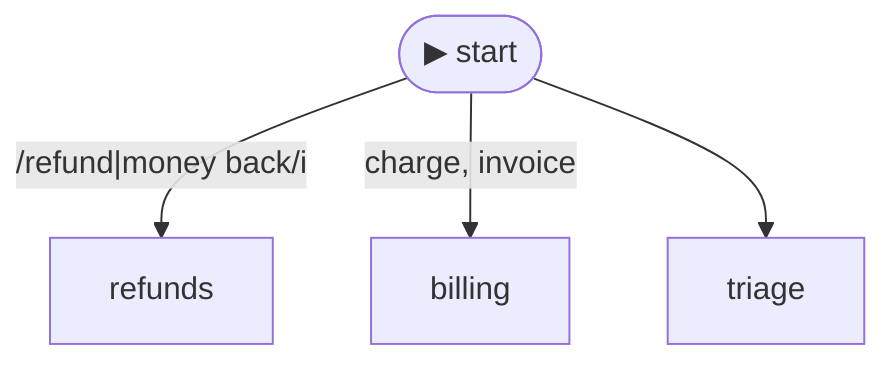

> An agent with several playbooks needs a **front door**: which skill does a turn
> start in? You could bury that decision in prompt prose or in `if` statements.
> Declare it instead — as **data** — and the same declaration routes the turn,
> survives a build-time check-up, and draws itself.

This page is the whole loop: three skills, one graph, and the picture.

## The code

Three `defineSkill` calls and one `skillGraph({ ... })`. Start rules are tried top
to bottom; the first that matches the user's message wins.

<SkillGraphTryIt demo="quickstart">
  <CodeFile path="docs-next/components/demos/skillGraphQuickstartDemo.ts" region="demo" title="components/demos/skillGraphQuickstartDemo.ts (region: demo)" />
</SkillGraphTryIt>

Feed the same object to an agent and the rules above ARE its runtime routing:

```ts
const agent = Agent.create({ provider, model })
  .skillGraph(buildQuickstartSkillGraph())
  .build();
```

## You can SEE it

`graph.toMermaid()` draws the graph you just declared. This block is its verbatim
output from a real run — note the entry edges **caption themselves with your
matchers**, because the rules are data, not opaque code:



Paste it into a PR description, a README, or [mermaid.live](https://mermaid.live)
— the routing review IS a picture review. (`#124;` is mermaid's escape for a `|`
inside an edge label — it renders back as the `|` in your regex.)

## What those lines bought

**Routing by data.** `match` takes a `RegExp`, `{ keywords: [...] }` (keywords
are case-insensitive, any-of, and whole-word), or `{ all: [...] }` — a conjunction
that fires only when every listed member matches ("zone AND audit-shaped", as data).
From the run above:

| user message | lands in | why |
|---|---|---|
| "I want my money back" | `refunds` | regex `/refund\|money back/i` |
| "why is there a CHARGE on my card" | `billing` | keyword `charge`, case-insensitive |
| "my charger broke" | `triage` | whole-word: `charge` does NOT match "charger" — the catch-all rule takes it |

`when: (ctx) => ...` predicates still work beside `match` (the catch-all above is
one) — they are the escape hatch for conditions that aren't about the message
text. Each rule takes exactly one of the two.

**Tools that follow the graph.** `scopeTools: true` stamps every wired skill with
`autoActivate: 'currentSkill'`, so `process_refund` is offered to the model only
while the graph is on `refunds` — not on every iteration from the start. The
default is `false` (today's behavior) until 10.0.0 flips it.

**A check-up you didn't have to write.** Because the rules are data, the build
checks them: a rule routing to a skill that isn't in `skills[]` refuses to build
(`rule-id-exists`, listing every bad id and the known catalog), two rules that
provably overlap or shadow each other get a warning naming both — and skill
bodies that mention tools are checked against the agent's **real** tool registry
at `Agent....build()`, automatically.

## The routing cascade (9.17.0)

Regex and keywords route the *phrasings you predicted*. For everything else,
declare each start rule's **intent as data** — one sentence plus real user
phrasings — and name one classifier to judge new messages against them:

```ts twoslash
import { Agent } from 'agentfootprint';
import { skillGraph, defineSkill, keywordScorer } from 'agentfootprint/context';
import { mock } from 'agentfootprint/providers';
const provider = mock({ reply: 'demo' });
const billing = defineSkill({ id: 'billing', description: 'Refunds and charges.', body: '…' });
const shipping = defineSkill({ id: 'shipping', description: 'Parcel tracking.', body: '…' });
// ---cut---
const graph = skillGraph({
  skills: [billing, shipping],
  start: {
    rules: [
      { use: 'billing',  match: { intent: 'customer wants a refund',
                                  examples: ['refund my order', 'charged twice'] } },
      { use: 'shipping', match: { intent: 'customer asks where a delivery is',
                                  examples: ['track my parcel'] } },
    ],
    classify: keywordScorer(), // no dependency; embeddingScorer(e) / llmClassifier(p) also fit
  },
});

const agent = Agent.create({ provider, model: 'claude-sonnet-4-5' })
  .skillGraph(graph, { continuity: 'conversation', strictness: 'guard' })
  .build();
```

Every turn now starts through a three-tier **cascade**, once, off the hot loop:

1. **Declared rules** (regex / keywords / `when`) — binary, decisive.
2. **The classifier** over your declared intents — with an explicit floor and a
   near-tie margin. A decisive winner routes; a near-tie **falls through**
   instead of coin-flipping.
3. **A menu** — only on declared ambiguity, the closest candidates lead the
   `read_skill` description (staying put is a first-class option) and the model
   picks.

Every verdict is recorded as `agentfootprint.skill.turn_routed` — the tier that
decided, every candidate's score (the losers too), the runner-up gap, and the
exact thresholds used. `graph.checkupIntents()` audits your examples with the
configured classifier before you ship them.

When tier 1 decided — a `match:` rule (RegExp / `{ keywords }` / `{ all }`) —
the verdict also carries the **witness**: the text out of the user's message
that made the rule true (`witness: { text, keyword? }`, on `turn_routed` and on
that hop's `cursorMove`). The commentary then reads *routed this turn to
`billing` because the message said "chargeback"* instead of *a rule matched* —
one sentence off either record, so a graph with **no** cascade (where the hop is
the only record) reads exactly the same.
The text is the matched substring of the **user message only**, whitespace-
collapsed and bounded to 80 characters. A `when` predicate is opaque code and a
scorer's evidence is its scores, so neither records a witness.

The two mount options:

- `continuity: 'conversation'` — the cursor rides `agent.checkpoint()`, so
  `followUp()` starts where the last turn ended. A sticky *default*, not a
  lock: a decisively different message still moves, an unmatched one opens the
  menu with STAY offered, and a cursor the deployed graph no longer knows is
  dropped **and recorded** (`turn_routed.droppedResume`).
- `strictness` — how much routing authority the model has: `'assist'`
  (default — today's gate; off-menu picks allowed and stamped
  `declinedOffer`), `'guard'` (picks only from an offered menu), `'rails'`
  (the model never routes; a menu then proceeds on the base prompt, recorded
  as `by: 'none'` — the honest cost of rails without a resolver).

Neither option set = byte-identical to 9.16, events included.

## Brains, a decider, and routing on outcome (9.19.0)

The same mount picks **who answers** and **what resolves a menu** — and an
edge can route on a tool's declared outcome instead of its prose:

```ts
import { Agent } from 'agentfootprint';
import { skillGraph, defineSkill, llmClassifier } from 'agentfootprint/context';
import { mock } from 'agentfootprint/providers';

const strong = mock({ reply: 'the strong model answered' }); // any LLMProvider port
const refund = defineSkill({
  id: 'refund',
  description: 'refund handling',
  body: 'Handle the refund.',
  // "The cursor picks the brain": refund answers on its own model.
  provider: strong,
  model: 'strong-model',
});
const triage = defineSkill({ id: 'triage', description: 'first contact', body: 'Triage.' });
const desk = defineSkill({ id: 'desk', description: 'denied refunds', body: 'Escalate.' });

const graph = skillGraph()
  .entry(triage, { match: { intent: 'customer wants a refund', examples: ['refund my order'] } })
  // Route on MEANING: only a DENIED refund tool result moves to the desk.
  .route(refund, desk, { onToolReturn: 'issue_refund', onToolStatus: 'denied' })
  .route(triage, refund)
  .classify(llmClassifier(mock({ reply: 'refund' })))
  .build();

const agent = Agent.create({ provider: mock({ reply: 'small answered' }), model: 'small' })
  .system('You are support.')
  .skillGraph(graph, {
    // N recorded gate refusals in one turn → the rest runs on the big brain.
    escalation: { provider: strong, model: 'strong-model', afterRefusals: 2 },
    // An outstanding menu resolves out-of-band — the sanctioned rails resolver.
    decider: { provider: strong, model: 'strong-model' },
  })
  .build();
void agent;
```

Every choice is on the record: `llm_start.brain` says which rung answered,
`skill.escalated` marks the flip with its evidence, `turn_routed { by:
'decider' }` names the resolver, and a tool's `status` rides
`stream.tool_end` and the routed edge. None declared = byte-identical,
events included.

## Next steps

- [Skills](doc:skills) — `defineSkill` itself, plus the full graph surface: `match` details, `scopeTools`, the check-up codes, `steps` for mid-turn hand-offs
- [Skills, explained](doc:skills-explained) — why progressive disclosure works, per-provider delivery, and the interactive graph essay
